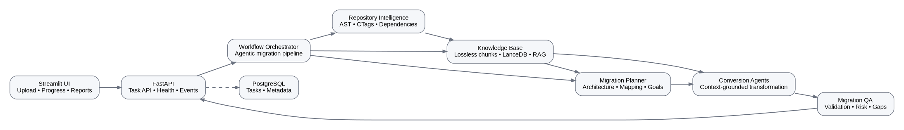
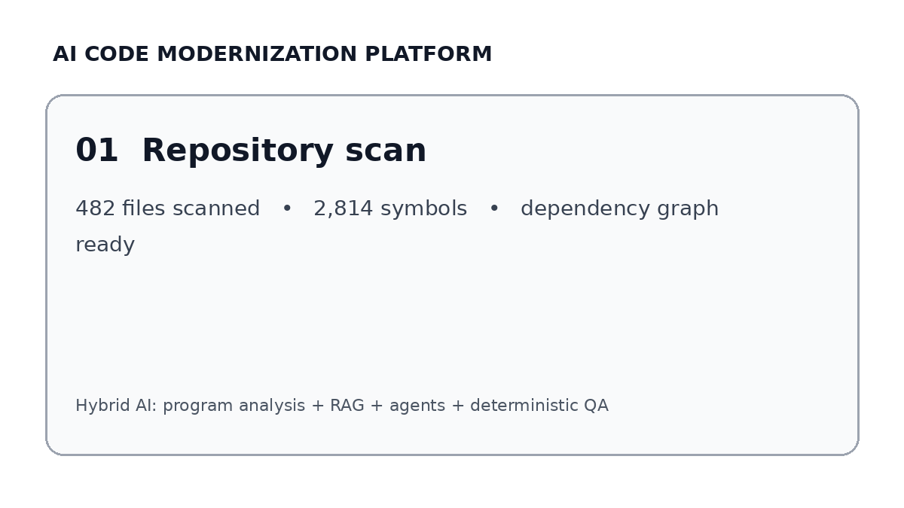

# AI Code Modernization Platform

> **Agentic legacy-code migration with program analysis, RAG, dependency intelligence, and migration QA.**

A portfolio-grade AI engineering project that turns a legacy repository into a structured migration plan, performs context-aware code transformation, and produces deterministic post-migration quality and risk signals.

The system deliberately combines **deterministic software analysis** with **probabilistic LLM reasoning** rather than sending an entire repository to a model in one prompt.

---
## 🚀 Deployment

**Status:** Deployed

The application is deployed as a public portfolio demonstration.

**Architecture:** GitHub Actions → Docker → Cloud deployment

> Live demo access is provided selectively for evaluation/interviews.

## Why this project is interesting

A naive code-conversion system looks like:

```text
Legacy repository → LLM → generated repository
```

That approach breaks down on real repositories because of context limits, missing dependencies, inconsistent transformations, hallucinated APIs, and weak validation.

This project uses a hybrid pipeline:

```text
Repository
    │
    ▼
Program Analysis ── AST / CTags / dependency graph / technology detection
    │
    ▼
Knowledge Base ─── lossless chunking + metadata-aware retrieval
    │
    ▼
Migration Planning ── target architecture + file/symbol mapping
    │
    ▼
Agentic Conversion ── context-grounded transformations
    │
    ▼
Post-Migration QA ── structural comparison + risk scoring + review checklist
    │
    ▼
Migration Report
```

### Key engineering decisions

- **Deterministic analysis before generation:** AST, symbol and dependency information grounds the agents.
- **Bounded retrieval instead of giant prompts:** large analysis artifacts are stored in a vector knowledge base and retrieved selectively.
- **Planning before conversion:** the target repository is not generated blindly; a migration plan provides structure and traceability.
- **QA after generation:** conversion is treated as an engineering workflow with measurable structural signals and risk, not as a single LLM response.
- **Provider abstraction:** cloud and self-hosted model endpoints can be selected through environment configuration.

---

## Visual walkthrough





## Architecture

```text
                    ┌──────────────────────┐
                    │     Streamlit UI     │
                    │ upload / progress /  │
                    │ reports / chat       │
                    └──────────┬───────────┘
                               │ HTTP / polling / events
                               ▼
                    ┌──────────────────────┐
                    │       FastAPI        │
                    │ API + task lifecycle │
                    └──────────┬───────────┘
                               │
                               ▼
                    ┌──────────────────────┐
                    │ Workflow Orchestrator│
                    └──────────┬───────────┘
                               │
        ┌──────────────────────┼──────────────────────┐
        ▼                      ▼                      ▼
   Repository              Knowledge              Planning
   Scanner                 Base / RAG             Agent
        │                      │                      │
   AST / CTags            LanceDB / chunks       mappings / goals
   dependencies           metadata filters       target structure
        └──────────────────────┼──────────────────────┘
                               ▼
                        Conversion Agents
                               │
                               ▼
                         Target Repository
                               │
                               ▼
                       Post-Migration QA
                               │
                    ┌──────────┴──────────┐
                    ▼                     ▼
              Risk / gaps          Showcase report
```

See [architecture.md](docs/architecture.md) for the detailed design and data flow.

---

## Core capabilities

### Repository intelligence

- Multi-language source scanning
- AST / tree-sitter analysis
- Universal CTags symbol extraction
- File and symbol dependency analysis
- Technology and framework detection
- Module-level complexity signals

### RAG and knowledge engineering

- Lossless analysis-artifact chunking
- Metadata-aware retrieval
- Source/target context separation
- Vector-backed knowledge storage with LanceDB
- Token-bounded context construction

See [KB_CHUNKING_SUMMARY.md](KB_CHUNKING_SUMMARY.md).

### Agentic migration workflow

- Scanner agent
- Knowledge-base agent
- Migration planning agent
- Conversion agent
- Post-migration analysis
- Conversational access to migration artifacts

### Migration QA + Release Engineering

The migration does not stop when the LLM finishes generating code. The target repository enters a deterministic **post-migration engineering gate**:

```text
Generated Target
      │
      ▼
Stack Detection ── Python / Node / Java / Go / PHP / .NET
      │
      ├── lint / format / syntax
      ├── type checks where available
      ├── dependency install when a lockfile/package manifest supports it
      ├── unit tests
      └── build / compile
      │
      ▼
Failure?
  ┌───┴────┐
  │        │
  No      Yes → Agno Repair Agent → edit files → re-run gates
  │                         │
  └───────────────<─────────┘
      │
      ▼
Release Gate
      │
  GREEN → CI bootstrap + reports + showcase + ZIP
  RED   → blocked artifact; no release ZIP is published
```

The repair loop uses Agno's built-in `FileTools` for controlled file inspection/editing, while validation commands remain allow-listed and deterministic. The project also uses Agno `WorkflowTools` for workflow-as-tool orchestration. This keeps the LLM in the reasoning/remediation role rather than allowing it to invent arbitrary shell commands.

Every successful migration receives:

- stack-aware lint/syntax/type/test/build validation
- bounded AI-assisted debugging/repair attempts
- `.migration/quality_report.json` and `.migration/quality_report.md`
- generated `.github/workflows/migration-quality.yml`
- existing structural migration/risk reports
- a showcase bundle
- a downloadable ZIP **only after the release gate is green**

This is intentionally a **release-readiness gate**, not a claim of mathematical semantic equivalence. A green gate means the generated project passed the configured executable checks for its detected ecosystem; business-level equivalence still needs representative integration and acceptance tests.

See [REPORTING_FEATURE_FAQ.md](REPORTING_FEATURE_FAQ.md) and [docs/post_migration_engineering.md](docs/post_migration_engineering.md).

---

## Engineering quality added for portfolio use

This repository includes a dependency-free quality gate and a deterministic evaluation harness so the project can be checked without starting a database or model server.

```bash
# Syntax + secret/artifact hygiene
python portfolio_quality/quality_gate.py .

# Unit tests
python -m pytest -q

# Evaluate a source/target benchmark pair
python evaluation/evaluate_migration.py \
  --source benchmarks/example/source \
  --target benchmarks/example/target
```

The evaluator reports deterministic structural metrics such as:

- relative file coverage
- Python symbol ratio
- Python syntax validity
- file / LOC / symbol deltas

A benchmark can additionally execute an explicit target test command:

```bash
python evaluation/evaluate_migration.py \
  --source benchmarks/example/source \
  --target benchmarks/example/target \
  --test-command "python -m unittest discover -s tests -v"
```

The included smoke benchmark passes both structural checks and two behavioral tests. This is **CI evidence, not proof of semantic equivalence**. Real portfolio claims should use multiple representative repositories and language-specific compile/build/test adapters. See [evaluation.md](docs/evaluation.md).

---

## Multi-language benchmark evidence

The repository includes a deterministic validation suite across **Python, JavaScript, Java, Go and PHP**. Each target is validated with the language-native toolchain where possible and with executable behavioral checks.

```bash
make benchmark
```

Latest checked-in evidence: **6/6 cases passed**. The cases are hand-authored reference targets and are explicitly **not** presented as LLM semantic-equivalence accuracy. This benchmark layer is designed to be extended with real migration corpora.

See [benchmark_results.md](docs/benchmark_results.md) and [evaluation.md](docs/evaluation.md).

## Project layout

```text
.
├── agent_service/              # FastAPI + agent orchestration backend
│   ├── app/
│   │   ├── application/        # agents and application workflows
│   │   ├── domain/             # domain models, services and interfaces
│   │   ├── infrastructure/     # DB, repositories, model providers, scanners
│   │   └── presentation/       # API routes and schemas
│   ├── Dockerfile
│   └── requirements.txt
├── streamlit_ui/               # interactive migration UI
├── evaluation/                 # deterministic migration evaluation harness
├── portfolio_quality/          # repository quality/security gate
├── tests/                      # lightweight regression tests
├── docs/                       # architecture, evaluation and security docs
├── .github/workflows/          # CI quality gates
├── docker-compose.yml
└── .env.example
```

---

## Run with Docker

1. Copy `.env.example` to `.env` and configure your model/database endpoints.
2. Never commit `.env`.
3. Start the services:

```bash
docker compose up --build
```

Default endpoints:

- UI: `http://localhost:8722`
- API: `http://localhost:8015`
- Swagger: `http://localhost:8015/docs`
- Health: `http://localhost:8015/healthz`

The compose file uses named volumes for migration workspaces and shared uploads. Containers run as non-root users with privilege escalation disabled. `/healthz` is liveness; `/readyz` checks configured database reachability.

---

## Model providers

The model layer is selected through environment variables and supports the providers already implemented by the project, including:

- OpenAI-compatible endpoints
- vLLM / OpenAI-compatible self-hosted endpoints
- Ollama
- Gemini
- Hugging Face

Model IDs, endpoints and credentials are intentionally configuration-driven. No provider credentials belong in source code.

---

## API lifecycle

A migration task follows a stateful lifecycle similar to:

```text
accepted
   ↓
running
   ↓
scanning → knowledge-base → planning → conversion → post-migration
   ↓
completed / failed
```

Task metadata is persisted when PostgreSQL is configured. Interrupted `running` tasks are marked failed during startup rather than remaining permanently stuck. Full checkpoint/resume of the underlying agent execution remains a future enhancement.

---

## Security posture

The portfolio repository is intentionally sanitized:

- `.env` is ignored and removed from the distributable project.
- `.env.example` contains placeholders only.
- Self-hosted GitLab URLs are configuration-driven rather than hard-coded.
- GitHub/GitLab tokens are not copied into returned user objects.
- Generated/runtime directories are ignored.
- A dependency-free quality gate checks for common secret and internal-network leaks.

See [security.md](docs/security.md).

**Before publishing an older copy of this project, rotate any credential that may have appeared in historical commits.**

---

## CI

GitHub Actions runs:

1. repository quality/security hygiene checks
2. Python syntax compilation
3. unit tests

The CI workflow is intentionally lightweight so it does not require PostgreSQL, Ollama, vLLM, or an external API key just to validate the repository.

---

## Evaluation roadmap

The included evaluator is the foundation for a stronger benchmark suite. Recommended benchmark additions are:

- source/target fixture repositories per language pair
- target-language compiler/build checks
- migrated-project test pass rate
- symbol-level mapping accuracy
- unsupported-pattern recall
- retrieval hit rate
- LLM retry rate
- latency, token usage and cost per migration

See [evaluation.md](docs/evaluation.md).

---

## Limitations

This is a portfolio and engineering demonstration, not a claim of fully autonomous production migration. Semantic equivalence is difficult to prove automatically. The system therefore exposes deterministic structural signals and review-oriented risk rather than pretending that an LLM confidence score is proof of correctness.

Known future improvements:

- durable worker/queue execution instead of in-process background execution
- checkpointed migration resume
- Alembic migrations for all database tables
- language-specific compile/test adapters
- benchmark dataset and regression dashboard
- distributed tracing and production metrics
- OIDC/JWT authentication for multi-user deployments

---

## License

MIT License.


## Production boundary

This is a **portfolio-grade engineering project**, not a claim of turnkey enterprise production readiness. The repository documents the remaining production work—durable worker queues, OIDC authorization, schema migrations, sandboxed uploads, rate limiting, OpenTelemetry, secret management, and language-specific build/test adapters—in [production_readiness.md](docs/production_readiness.md).

## Flagship-level engineering loop

The platform now exposes the live Agno execution plan in the UI, runs post-migration engineering gates (CI, linting, syntax/type checks, tests, builds and bounded AI repair), and generates a migrated-code architecture intelligence page with a module diagram, technology profile and README-style analysis. Final packaging remains gated by the engineering quality result.


## Dependency-aware symbol migration

Symbol-wise migration now separates **size** from **dependency topology**.
The legacy `>150 LOC` split guardrail remains, but planning also considers
cyclomatic complexity, fan-in, and fan-out. The planner explicitly supports
one-to-many, many-to-one, and many-to-many dependency relationships.

Generated fragments are followed by a deterministic import-normalization pass
so imports from later source symbols are moved into the correct language-level
import section before linting, testing, and build gates.

See `docs/dependency_aware_symbol_migration.md` for the policy and rationale.


### ARM64 / Docker dependency note

The agent uses Agno's `FastEmbedEmbedder` for local embeddings instead of the
Sentence Transformers stack. This avoids pulling a multi-gigabyte CUDA/PyTorch
dependency tree into the CPU-oriented service container and is better suited to
Apple Silicon/ARM64 smoke-test deployments.

## Render Free deployment


The public portfolio demo uses two Render Free Docker web services (Streamlit UI + FastAPI agent service) and an external managed PostgreSQL database. Local Docker Compose retains the complete multi-service engineering topology, including LiteLLM, local Postgres, and optional vLLM.
